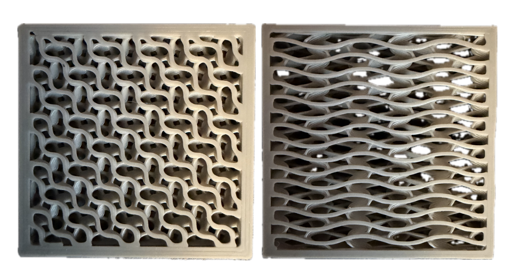
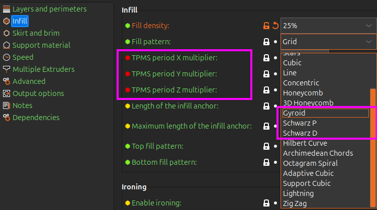
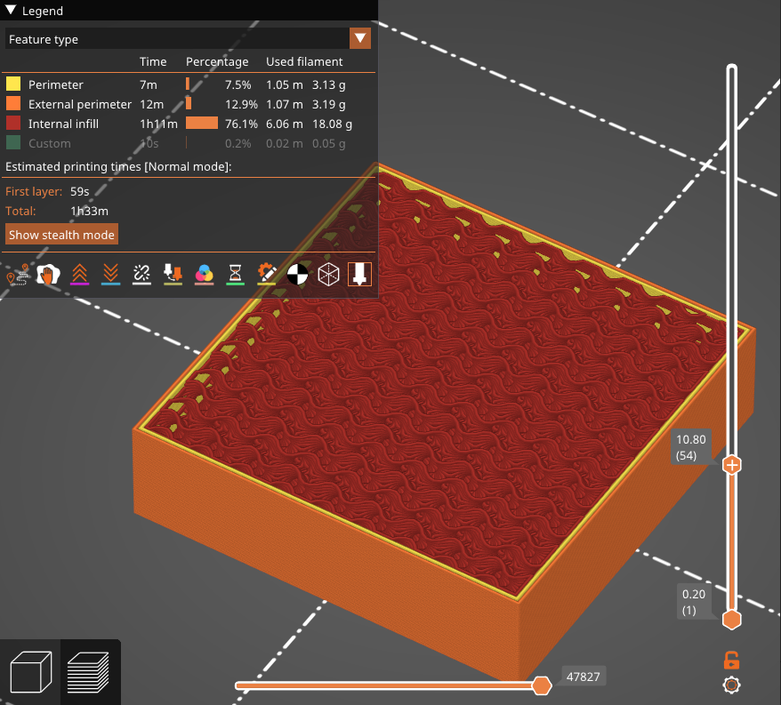
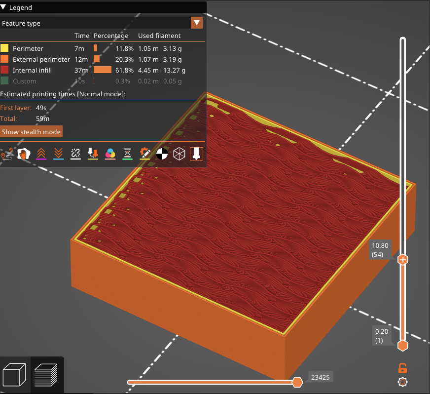

# Custom Infill Slicer

This is a work-in-progress fork of [PrusaSlicer](https://github.com/prusa3d/PrusaSlicer) I'm building to get more direct control over TPMS infill patterns. This work is being done in support of an overarching project relating to fluid flow through such patterns, but I chose to fork PrusaSlicer and make this public in case anyone else finds it useful.

*TPMS* = *Triply Periodic Minimal Surface*.

See the [Equation-Based-Lattice-Structure-Dataset](https://github.com/jwf23/Equation-Based-Lattice-Structure-Dataset) repo [1] for a thorough reference on TPMS definitions.

[1] J. W. Fisher, S. W. Miller, J. Bartolai, T. W. Simpson, and M. A. Yukish, “Catalog of triply periodic minimal surfaces, equation-based lattice structures, and their homogenized property data,” Data in Brief, vol. 49, p. 109311, Aug. 2023, doi: 10.1016/j.dib.2023.109311.

## Purpose

The motivation here is to move the work of producing TPMS lattices from typical design tools into the slicer itself, like any other infill pattern. 
The issue I've faced with the *TPMS Lattice STL* -> *Slicer* approach is that many of the automatic infill optimizations
are lost, modifiers that would typically be available for infill are not available unless you want to regenerate the STL mesh,
and everything is treated as a perimeter or thin wall instead of an infill pattern. This leads to slow prints, weird travel paths, and so on.

The main additions here are the following:

- Adds Schwarz P and Schwarz D alongside the existing gyroid infill patterns.
- Adds three per-axis period multipliers (`tpms_period_x / _y / _z`) so you can stretch
the unit cell along any axis without touching your STL.

Everything else is the same as the upstream PrusaSlicer and slic3r.

## Using the additional patterns

Import your part as usual, go to `Print Settings` tab, and you'll see the additional options under `Infill`. 

*Note*: The period modifiers will only show up under expert mode.

## Example

For normal gyroid infill, just leave all the period modifiers set to 0.

With a 3.0x modifier in the y direction:

*Note*: The infill percentage is the only way I have at the moment of tweaking the density, but it's not precisely calibrated to match the density of the default gyroid pattern or anything (see the examples above - you'll notice the 'filament used' metric for the 'internal infill' to be noticeably different when the 3.0x y-direction modifier is added). You may need to play around with this a bit if this is important to you.

## Changes

All of the major changes are in `src/libslic3r/` and `src/slic3r/GUI`. 

*Question*: Why PrusaSlicer specifically instead of slic3r when all of the changes are in the slic3r directory?

*Answer*: I have a Prusa Mini, I've always used PrusaSlicer - I imagine the changes could be applied directly to slic3r or any other fork of slic3r, but this is just a personal project and modifying PrusaSlicer directly happened to be the path of least resistance.

`src/libslic3r/CMakeLists.txt`
`src/libslic3r/Fill/Fill.cpp`
`src/libslic3r/Fill/FillBase.cpp`
`src/libslic3r/Fill/FillBase.hpp`
`src/libslic3r/Fill/FillGyroid.cpp`
`src/libslic3r/Fill/FillGyroid.hpp`
`src/libslic3r/Fill/FillSchwarzD.cpp`
`src/libslic3r/Fill/FillSchwarzD.hpp`
`src/libslic3r/Fill/FillSchwarzP.cpp`
`src/libslic3r/Fill/FillSchwarzP.hpp`
`src/libslic3r/Fill/FillTPMSBase.cpp`
`src/libslic3r/Fill/FillTPMSBase.hpp`
`src/libslic3r/Preset.cpp`
`src/libslic3r/PrintConfig.cpp`
`src/libslic3r/PrintConfig.hpp`
`src/slic3r/GUI/ConfigManipulation.cpp`
`src/slic3r/GUI/Tab.cpp`

---
***Original PrusaSlicer README below***
---

# PrusaSlicer

You may want to check the [PrusaSlicer project page](https://www.prusa3d.com/prusaslicer/).
Prebuilt Windows, OSX and Linux binaries are available through the [git releases page](https://github.com/prusa3d/PrusaSlicer/releases) or from the [Prusa3D downloads page](https://www.prusa3d.com/drivers/). There are also [3rd party Linux builds available](https://github.com/prusa3d/PrusaSlicer/wiki/PrusaSlicer-on-Linux---binary-distributions).

PrusaSlicer takes 3D models (STL, OBJ, AMF) and converts them into G-code
instructions for FFF printers or PNG layers for mSLA 3D printers. It's
compatible with any modern printer based on the RepRap toolchain, including all
those based on the Marlin, Prusa, Sprinter and Repetier firmware. It also works
with Mach3, LinuxCNC and Machinekit controllers.

PrusaSlicer is based on [Slic3r](https://github.com/Slic3r/Slic3r) by Alessandro Ranellucci and the RepRap community.

See the [project homepage](https://www.prusa3d.com/slic3r-prusa-edition/) and
the [documentation directory](doc/) for more information.

### What language is it written in?

All user facing code is written in C++.
The slicing core is the `libslic3r` library, which can be built and used in a standalone way.
The command line interface is a thin wrapper over `libslic3r`.

### What are PrusaSlicer's main features?

Key features are:

* **multi-platform** (Linux/Mac/Win) and packaged as standalone-app with no dependencies required
* complete **command-line interface** to use it with no GUI
* multi-material **(multiple extruders)** object printing
* multiple G-code flavors supported (RepRap, Makerbot, Mach3, Machinekit etc.)
* ability to plate **multiple objects having distinct print settings**
* **multithread** processing
* **STL auto-repair** (tolerance for broken models)
* wide automated unit testing

Other major features are:

* combine infill every 'n' perimeters layer to speed up printing
* **3D preview** (including multi-material files)
* **multiple layer heights** in a single print
* **spiral vase** mode for bumpless vases
* fine-grained configuration of speed, acceleration, extrusion width
* several infill patterns including honeycomb, spirals, Hilbert curves
* support material, raft, brim, skirt
* **standby temperature** and automatic wiping for multi-extruder printing
* [customizable **G-code macros**](https://github.com/prusa3d/PrusaSlicer/wiki/PrusaSlicer-Macro-Language) and output filename with variable placeholders
* support for **post-processing scripts**
* **cooling logic** controlling fan speed and dynamic print speed

### Development

If you want to compile the source yourself, follow the instructions on one of
these documentation pages:
* [Linux](doc/How%20to%20build%20-%20Linux%20et%20al.md)
* [macOS](doc/How%20to%20build%20-%20Mac%20OS.md)
* [Windows](doc/How%20to%20build%20-%20Windows.md)

### Can I help?

Sure! You can do the following to find things that are available to help with:
* Add an [issue](https://github.com/prusa3d/PrusaSlicer/issues) to the github tracker if it isn't already present.
* Look at [issues labeled "volunteer needed"](https://github.com/prusa3d/PrusaSlicer/issues?utf8=%E2%9C%93&q=is%3Aopen+is%3Aissue+label%3A%22volunteer+needed%22)

### What's PrusaSlicer license?

PrusaSlicer is licensed under the _GNU Affero General Public License, version 3_.
The PrusaSlicer is originally based on Slic3r by Alessandro Ranellucci.

### How can I use PrusaSlicer from the command line?

Please refer to the [Command Line Interface](https://github.com/prusa3d/PrusaSlicer/wiki/Command-Line-Interface) wiki page.
